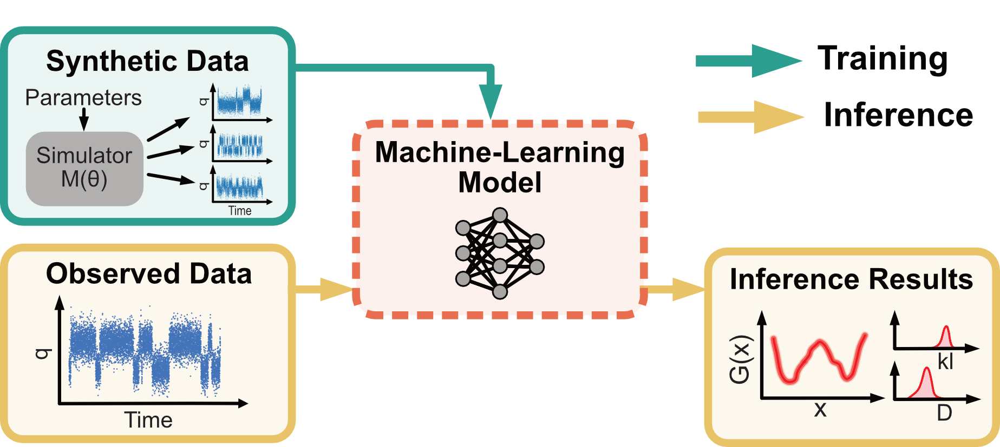

## SBIsmfs: Simulation-based inference for single-molecule force spectroscopy
SBIsmfs is a Python module for simulation-based inference for single-molecule force spectroscopy experiments. The module provides tools for simulating syntehtic force-spectrscopy experiments, training an amortized and sequential posterior model, and sampling from the posterior distribution. The code is based on the [sbi-toolkit](https://sbi-dev.github.io/sbi/latest/), which is using Pytorch.




## Installing code 
Clone the code repository:
```commandline
git clone https://github.com/Dingel321/SBIsmfs.git 
cd SBIsmfs
```

Create a Conda environment with the required dependencies:
```commandline
conda create --name sbi-smfs python=3.9
conda activate sbi-smfs
pip install -r requirements.txt
```

Install with
```commandline
python3 -m pip install .
```

## Running the code
The code can be run with the following command:
```commandline
    train_sequential_posterior \
        --config_file "path_to_config_file.config" \
        --num_rounds number_of_sbi_rounds \
        --num_sim_per_round number_of_simulations_per_round \
        --num_workers number_of_workers \
        --observation_file "file_to_smfs_trajectory" \
        --posterior_file "name_for_posterior_model" \
        --device device \
        --save_interval Save_interval_for_the_posterior_model
```
Simple visualization of the posterior distribtuion:
```python
    import pickle
    import torch
    from sbi_smfs.analysis.plot_posterior import plot_spline_ensemble

    with open(f"path_to_posterior", "rb") as handle:
        posterior = pickle.load(handle)

    samples = posterior.sample((1000000,))
    samples[:, 2:] = samples[:, 2:] - torch.mean(samples[:, 2:], dim=1).reshape(-1, 1)

    plot_spline_ensemble(samples, 1000, config_file, label='Samples', color="blue", alpha=0.02)
```

## Installation can be tested with:
Install pytest with `pip install pytest` 

Run tests with `pytest tests/`
